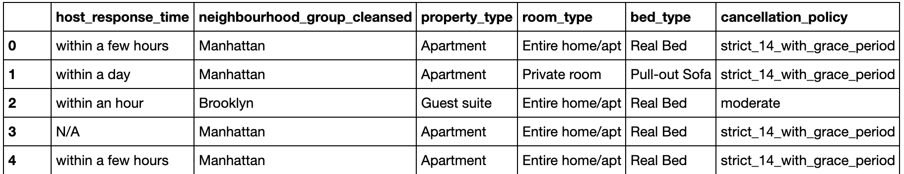
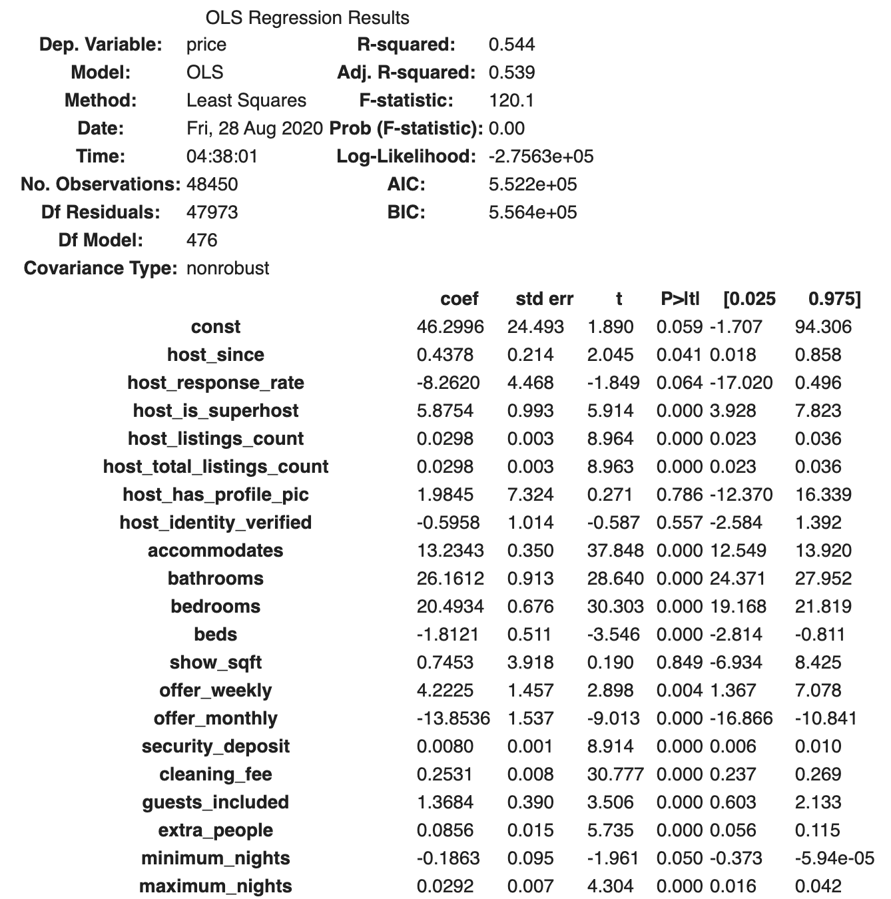
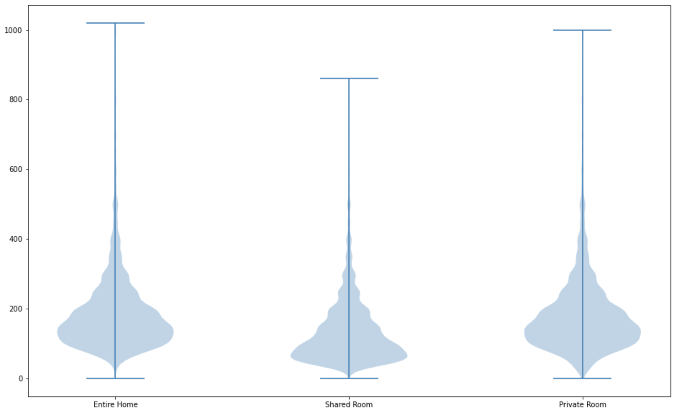
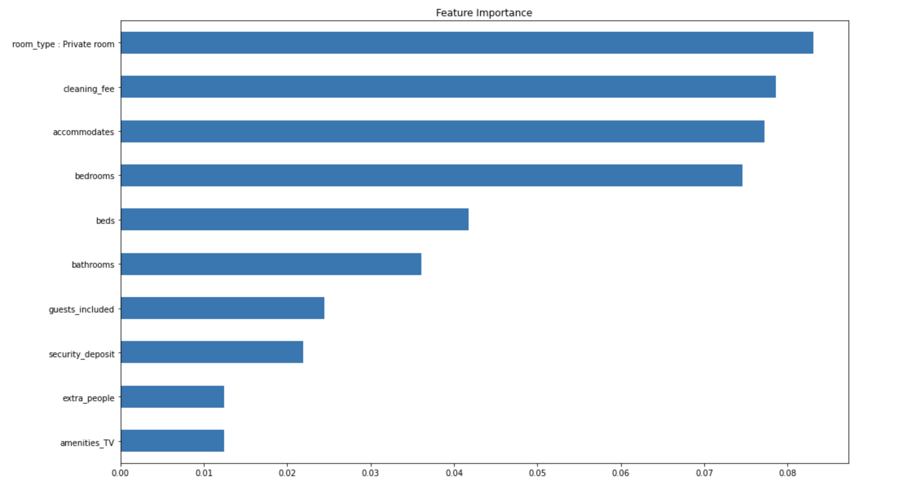

# Premium Features in Airbnb Listings

## Introduction
- Airbnb is a vacation rental online marketplace
- It's mission is to help create a world where you can belong anywhere and where people can live in a place, instead of just traveling to it.
- Hosts are able to set their own prices with the help from Airnb algorithms

    This study is to investigate and evaluate how the hosts are leveraging different features of a renting property to set the prices. In other words, what features of a property is important to the hosts and what do they deem valueable when considering a property as a rental property? More importantly, how can we identify the features the hosts used to justify a higher price point? In this study, we will define such features as **premium features**.   
  
    The dataset used to tackle this question is from [Inside Airbnb](http://insideairbnb.com/get-the-data.html),a website created by Murray Cox. This study will use datasets of NYC collected on August 19th 2019 and apply machine learing techniques to identify premium features. This dataset and the preprocessed dataset can be also be found on this [google drive](https://drive.google.com/drive/folders/10YZMuBSQ3WaaT77UT2nNNkRryV5G0QnU?usp=sharing). Additional code can also be found on this [google colab](https://colab.research.google.com/drive/1umxFAd7GMGCf99Y8nmntMb4Wc7y3YwU6?usp=sharing).
    
## Preprocessing
- Dataset includes over 40,000 samples and 200 initial features such as host identifications, property types, and amenities.
- A snippet of the data (only a few selected features are shown in this snippet):

- Applied dummification and used [TextBlob](https://textblob.readthedocs.io/en/dev/) to extract polarity (positive/negative emotions) and subjectivity scores from certain text format features.
- A baseline linear regression model is also applied here to help feature selection and engineering.

## Models
- Linear regression model is applied using *Statsmodels' Ordinary Least Square (OLS)*. A snippet of the OLS summary table is shown below:

- By optimizing the r-squared score, the model can use more of the features to explain the variance in prices. The more accurate the model can predict the pricing, the better the model has captured the features and their importance to pricing. However, the data is not standarized during the process, I can't directly compare the coefficients. Violin plots that captures the price variance and distribution are used as a proxy to visualize the effects of each features on price. Below is an example of using violin plot in this case:

- A random forest model (RFM) is also used for two reasons:
    - There are over 400 features after preprocessing. A random forest regressor is very good at dealing with data with many features.
    - Random forest model's features importance attribute is very helpful when trying to identify premium features.
- The initial fitting of the RFM performed much better than linear regression model on the training set with a r-squared score of 0.887. However, the model is overfitted and the r-squared on testing set is 0.583
- Grid search is applied to optimize the RFM. Unfortunately, the grid search was not able to complete running before the deadline of this project. The hyperparameters were selected manually.
- Even though the model might not be most optimized, its feature importance still gives us some useful information on the relationship between features and prices.

## Retrospect
- Multicollinearity was a persistent issue when working on this dataset. One way to deal with this is to further reduce the dataset's dimensions. Could consider using data compression techniques like principle component analysis.
- More data is most definitely going to provide more insight on these features. However, the time in which the data was collected and the location are two important factor to consider when including additional datasets.
- Auxillary data should also be considered.

## Tech used
Python, Pandas, Numpy, Matplotlib, Scikit-learn, Statsmodels, TextBlob
